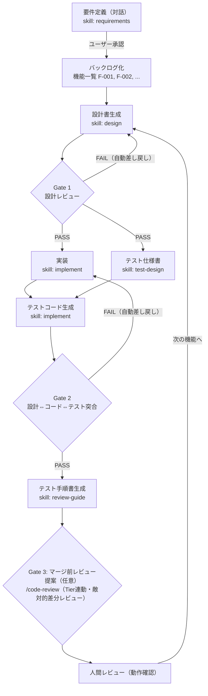

# AI Orchestrator — 一人SIerフレームワーク

**Claude Code だけで「設計 → 実装 → テスト → チェック」の開発パイプラインを回す、AIオーケストレーションのフレームワークです。**

要件を自然言語で渡すと、Claude Code が `CLAUDE.md` と複数の Skill を順番に実行し、設計書・ソースコード・テスト・整合性レポートまでを一貫して生成します。「一人で受託開発の全工程を回す（一人SIer）」をAIで実現するための土台です。

### 特徴

- **ハイブリッド開発プロセス** — 全体はアジャイル（バックログ駆動・機能単位のイテレーション）、1機能の中はウォーターフォール（品質ゲート付きの工程直列）。[詳細](#開発の進め方--アジャイル--ウォーターフォールのハイブリッド)
- **API従量課金なし** — Claude Code（Pro/Maxプラン）の範囲内で完結
- **品質ゲート内蔵** — Gate 1（設計レビュー）/ Gate 2（設計⇔コード⇔テスト突合）で自動差し戻し
- **セッション再開** — 中断しても `project_status.yaml` から続きを再開
- **ステークホルダー向け説明資料も自動生成** — 品質レポート・セキュリティ証跡・設計サマリー・プレゼン用スライド（[Gamma](https://gamma.app) 取り込み → PPT/PDF 化対応）を納品時に一括生成（[詳細](#納品ドキュメントステークホルダーへの説明gamma対応)）
- **レベル2セキュリティ同梱（無料ツールのみ）** — シークレット/SCA/SAST/ライセンス/DASTをCIの品質ゲートとして接続（[詳細](#セキュリティレベル2--無料ツールのみ)）

### 誰のためか

- AIオーケストレーションで一人SIer型の開発フローを試したい人
- 自分のプロジェクトに「設計→実装→テスト」の型と、AI生成コード向けのセキュリティを導入したい人

MITライセンスで公開しています。フォーク・改変・再配布は自由です（[LICENSE](LICENSE)）。

## 開発の進め方 — アジャイル × ウォーターフォールのハイブリッド

このフレームワークはどちらか一方ではなく、**2つを組み合わせたハイブリッド**です。

- **プロジェクト全体はアジャイル（イテレーティブ / インクリメンタル）**
  要件をバックログ（機能一覧 F-001, F-002, ...）に分解し、**1機能ずつ**「設計→実装→テスト→レビュー」を完結させてから次の機能へ進みます。動くものが機能単位で積み上がり、途中の要件追加・変更はバックログに積んで次のイテレーションで扱います。
- **1機能の内側はウォーターフォール（V字モデル）**
  各機能は「設計 → Gate 1 → 実装＋テスト設計 → Gate 2 → レビュー」を必ずこの順で通ります。設計書・コード・テストを品質ゲートで突合するドキュメント駆動なので、受託開発でステークホルダーに見せられる設計書と品質証跡が自然に残ります。納品時にはこれらを元に、ステークホルダー向けの説明資料一式（品質・セキュリティレポート＋プレゼン用スライド）を `delivery` スキルで自動生成できます（後述のオンデマンドスキル）。

つまり「全機能をまとめて設計してから一気に実装する」純ウォーターフォールでも、「設計書なしでコードから書き始める」プロトタイピングでもありません。**ドキュメントと証跡を残しながら、機能単位で速く回す**ための構成です。

### パイプラインの流れ（1機能ごとに繰り返す）



実装とテスト仕様書は**同じ設計書から並列に**作られ（テストファースト思想: テスト設計は実装コードを見ない）、Gate 2 で三者を突合します。Gate の差し戻しは自動で行われ、3回連続 FAIL したときだけ人間にエスカレーションされます。

Gate 2 の後、`review-guide` が機能の Tier（リスク）を自動判定し、**Gate 3 として `/code-review`（マージ前の敵対的差分レビュー）を Tier に応じた深さで提案**します。これは強制ではなく助言で、実行するかは人間が決めます（Tier S/A は既定で提案、B 以下は差分の危険度に応じて提案）。加えて、実装中は誠実性フック（`.claude/hooks/honesty_check.py`）が「偽成功・握り潰し」等をコードを書いた瞬間に機械検出します。詳細は[オンデマンド／自動レイヤー](#オンデマンドスキルと自動レイヤー)。

### 人間（あなた）がやることは実質3つ

| タイミング | やること |
|---|---|
| 最初 | 要件定義の対話に答え、要件定義書を**承認**する（承認まで先へ進まない） |
| 1機能が完成するたび | 生成されたテスト手順書（`docs/review_map/`）どおりに動作確認する |
| Gate が3回連続 FAIL したとき | エスカレーションを受けて判断する（設計・実装・差し戻しは普段 AI が自走） |

### 各工程と成果物の対応

| 工程 | Skill | 成果物 |
|---|---|---|
| 0. 要件定義（対話型） | `requirements` | `docs/requirements.md` / `docs/backlog.md` |
| 1. パイプライン制御・再開 | `orchestrate` | `.orchestrator/project_status.yaml` |
| 2. 設計 | `design` | `docs/design/F-XXX.md` |
| 3. **Gate 1**: 設計レビュー | `consistency-check` | `docs/consistency_report/F-XXX_gate1.md` |
| 4. 実装（5と並列） | `implement` | `src/` |
| 5. テスト仕様書（4と並列） | `test-design` | `docs/test_spec/F-XXX.md` |
| 6. テストコード生成 | `implement` | `tests/` |
| 7. **Gate 2**: 整合性チェック | `consistency-check` | `docs/consistency_report/F-XXX_gate2.md` |
| 8. テスト手順書 | `review-guide` | `docs/review_map/F-XXX.md` |
| 9. **Gate 3**: マージ前レビュー提案（任意） | `/code-review` | Tier連動の敵対的差分レビュー（提案。人間が実行可否を判断） |

### オンデマンドスキルと自動レイヤー

**オンデマンドスキル**（パイプライン外。必要なときに指示して単発実行）:

| Skill | 用途 | 実行タイミングの目安 |
|---|---|---|
| `audit` | 敵対的コードベース監査（機能単位ゲートの死角＝境界間・並行性・IDOR・偽成功バグを全域横断で反証探索）。高価値レンズは専門サブエージェント（`.claude/agents/`）を活用 | 機能3〜5件ごと / リリース前 / 定期 |
| `quality-report` | ステークホルダー向け品質レポート（テスト・バグ・ゲート通過状況） | 納品・報告時 |
| `security-report` | ステークホルダー向けセキュリティ証跡レポート | 納品・報告時 |
| `delivery` | ステークホルダー向けの説明資料一式を `docs/delivery/` に集約（上2つ＋設計サマリー＋[Gamma](https://gamma.app) 取り込み用スライド）。任意で共有Webページ（claude.ai Artifact）も生成可（[詳細](#納品ドキュメントステークホルダーへの説明gamma対応)） | 納品時 |

**自動／任意レイヤー**（明示指示や条件で働く。すべて opt-in か助言的で、パイプラインをブロックしない）:

| レイヤー | 何をするか | いつ |
|---|---|---|
| 誠実性フック（`.claude/hooks/honesty_check.py`） | 偽成功・無音握り潰し・`Bearer null` 等をコードを書いた瞬間に機械検出（非致命） | Edit/Write 時に自動（`.claude/settings.json` の hooks で発火） |
| Gate 3（`/code-review`） | Tier連動の敵対的差分レビューを提案 | review-guide 後・マージ前（人間が実行可否を判断） |
| Context7 MCP 照合 | 依存追加前にパッケージの実在性・最新APIを裏取り（slopsquatting対策） | `implement` で依存を足すとき（Context7 が使えないときは従来ルールにフォールバック） |
| 専門サブエージェント（`.claude/agents/`） | `honesty-auditor` / `authz-idor-auditor` / `contract-checker` が監査の高価値レンズを担当 | `audit`・レビューの検証時 |
| 定期 audit（`templates/scheduled-audit.yml`） | cron で audit を自動実行し結果を PR で起票（**opt-in・self-hosted・実行ごとに API 課金**） | 自分の repo にコピーして有効化した場合のみ（既定 四半期） |

## クイックスタート（一本道）

clone から最初の成果物が出るまでを、この順番どおりに進めれば動きます。

### 1. clone してフックを入れる

```bash
git clone https://github.com/high-tech-r/orchestrator-skills.git
cd orchestrator-skills
pip install pre-commit && pre-commit install   # コミット前のシークレット検出
```

### 2. リポジトリ設定の手動ステップ（フォークして使う場合・すべて無料）

GitHubの画面でのみ有効化できる設定。**最初に1回だけ**実施する（自分のリポジトリとして運用する場合）。

1. Settings → Code security → **Dependabot alerts / security updates** を Enable
2. Settings → Code security → **Secret scanning（push protection）** を Enable
3. https://socket.dev から **Socket GitHub App** をインストール（slopsquatting対策・OSS無料）
4. Settings → Branches → main の保護で **`Security (Level 2)` を Required** に設定
5. https://semgrep.dev/explore で **AI Security / Shadow AI パック**の最新名を確認し、`.github/workflows/security.yml` のコメント箇所を有効化

> まず動かして試すだけなら 2 はスキップ可。後から有効化しても問題ありません。
> 各ステップの背景は [`docs/security/LEVEL2_SECURITY.md`](docs/security/LEVEL2_SECURITY.md) を参照。

### 3. Claude Code を起動して最初の要件を投入する

```bash
claude
```

起動したら、プロンプトに要件を貼るだけ:

```
以下の要件でオーケストレーションを開始してください。

プロジェクト名: シンプルTODOアプリ
技術スタック: Python / FastAPI / SQLite
機能:
- F-001: タスク追加（タイトル必須、説明任意、作成日時自動記録）
- F-002: タスク一覧取得（作成日時降順、完了/未完了フィルタ）
```

Claude Code が `CLAUDE.md` を読み、要件定義 → 設計 →[Gate 1]→ 実装＋テスト →[Gate 2]→ レビューガイド の順にパイプラインを回し、`docs/` `src/` `tests/` に成果物を生成します。中断しても次回 `前回の続きからお願いします` で再開できます。

> 上の技術スタックは一例です。**言語・フレームワークは任意**（Node.js / Go / Java など）。同梱のセキュリティCIも言語非依存で、使う言語に合わせて一部だけ設定を有効化します（[詳細](docs/security/LEVEL2_SECURITY.md)）。

## 既存プロジェクトに組み込む

新規プロジェクトだけでなく、**すでにあるリポジトリにも後付けできる**。必要なファイルを目的別にコピーする。

### A. オーケストレーション本体（必須）

これが無いとパイプラインは動かない。フォルダごとコピーする。

```
CLAUDE.md            # ★既存に CLAUDE.md があるなら「上書きせずマージ」
.claude/skills/      # 全スキル + 共通ルール（_shared）+ Tier定義。フォルダごと
.claude/hooks/       # 誠実性チェック（honesty_check.py）。★settings.json の hooks で発火させる
.claude/agents/      # 監査用の専門サブエージェント（honesty-auditor / authz-idor-auditor / contract-checker）。フォルダごと
```

> `.claude/hooks/honesty_check.py` は最優先原則「嘘をつくコードの禁止」の機械的バックストップ。
> Edit/Write 直後に無音 catch・握り潰し・`Bearer null` 等を検出する。有効化するには
> `.claude/settings.json` の `hooks` ブロック（下記 B でコピー）も併せて入れること。

### B. レベル2セキュリティ一式（任意・推奨）

セキュリティも入れるなら追加でコピーする。

```
.pre-commit-config.yaml  .gitleaks.toml          # シークレット（コミット前）
.github/workflows/security.yml  dast-zap.yml     # CI品質ゲート / DAST
.github/PULL_REQUEST_TEMPLATE.md                 # AI利用チェック
.zap/rules.tsv                                   # ZAP抑制ルール
.claude/settings.json                            # 機密ファイルの読み取り禁止 + 誠実性フックの発火設定
docs/security/LEVEL2_SECURITY.md                 # 手順書
```

> **Dependabot を使う場合**: `templates/dependabot.yml`（言語・docker 用）を **自分の
> リポジトリの `.github/dependabot.yml` にコピー**してください。テンプレートを
> `templates/` に置いているのは、その言語・docker 更新をこのリポジトリ自体で走らせない
> ためです（このフレームワーク repo は github-actions 限定の `.github/dependabot.yml`
> を別途持ち、ワークフローの SHA ピン留めだけを追従更新します）。
> `labels:` で指定するラベルは事前に Issues → Labels で作成するか、不要なら削除します。

### C. 定期 audit の自動化（任意・opt-in）

audit（敵対的監査）を cron で自動実行したい場合のみ、`templates/scheduled-audit.yml` を
**自分のリポジトリの `.github/workflows/scheduled-audit.yml` にコピー**する。

```
templates/scheduled-audit.yml  →  .github/workflows/scheduled-audit.yml
```

- リポジトリ Secrets に **`ANTHROPIC_API_KEY`** を登録する（`Settings → Secrets and variables → Actions`）。
- 既定は**四半期ごと**。頻度は cron で調整（週次・月次にするほど**実行ごとに API 課金**が増える）。
- 中央監視ではなく、**あなたの repo・あなたの API キーで回る self-hosted 型**。作者は何も見ない。
- audit は**修正しない**。結果を `docs/audit/` とバックログに書いた PR を出すだけ（起票 → あなたが優先度判断）。
- 手動トリガー（Actions タブの workflow_dispatch）でも回せる。**入れなくても手動で `audit` スキルを呼べば十分**。

### 上書きせず「マージ」するファイル

既存プロジェクトに同名ファイルがある場合、潰さず中身を合流させる。

| ファイル | 対応 |
|---|---|
| `CLAUDE.md` | 既存の規約に本フレームワークのセクションを追記 |
| `.gitignore` | 既存ルールにシークレット/言語別の項目を追加 |
| `.claude/settings.json` | 既存の `permissions` があれば `deny` 配列を結合。`hooks.PostToolUse` に誠実性フックを追加（既存フックがあれば配列に追記） |

### コピー不要

`README.md` / `LICENSE` / `example_requirements.yaml` はこのリポジトリ固有の説明物なので不要。

### 組み込み後

`claude` を起動して `前回の続きから` ではなく新しい要件を投入すれば、既存コードを文脈に含めてパイプラインが回る。**言語別のセキュリティ設定（dependabot 等）は `orchestrate` スキルが初期化時に自動で有効化する**ため、利用者がYAMLを手で触る必要はない（手動でやる場合は [`docs/security/LEVEL2_SECURITY.md`](docs/security/LEVEL2_SECURITY.md) 参照）。

> ⚠️ **既存PJはセキュリティゲートを即 block にしない**。過去の負債（古いCVE・既存指摘）で
> 無関係なPRまで赤になる。**`SECURITY_GATE_MODE=report`（助言モード）で導入 → 既存指摘を棚卸し
> → `block` → ブランチ保護で Required** の順で段階導入する（[手順](docs/security/LEVEL2_SECURITY.md#既存プロジェクトへの段階導入重要)）。
> 新規PJは最初から block（既定）でよい。秘密情報スキャンは常に block。

---

以下は各トピックの詳細です。

## セッション再開

中断しても、次回 Claude Code 起動時に:

```
前回の続きからお願いします
```

と入力すれば、`.orchestrator/project_status.yaml` を読んで前回の続き（処理中だった機能・工程）から再開する。

## ディレクトリ構成

```
orchestrator-skills/
├── CLAUDE.md                        # オーケストレーターのメインルール
├── .claude/
│   ├── settings.json                # 権限制御（permissions.deny）＋ 誠実性フックの発火設定（hooks）
│   ├── hooks/
│   │   └── honesty_check.py         # 誠実性チェック（偽成功・握り潰しを書いた瞬間に検出）
│   ├── agents/                      # 監査用の専門サブエージェント（audit が活用）
│   │   ├── honesty-auditor.md       # L2/L5: 偽成功・握り潰し・嘘のインターフェース
│   │   ├── authz-idor-auditor.md    # L1: 認可・マルチテナントIDOR
│   │   └── contract-checker.md      # L3/L4: 境界契約・並行性
│   └── skills/
│       ├── _shared/
│       │   └── test-quality-rules.md  # テスト品質ルールの共通真実源
│       ├── requirements/SKILL.md    # 要件定義（対話型）
│       ├── orchestrate/SKILL.md     # パイプライン制御・初期化
│       ├── design/SKILL.md          # 設計書生成
│       ├── implement/SKILL.md       # ソースコード生成
│       ├── test-design/SKILL.md     # テスト仕様書生成
│       ├── consistency-check/SKILL.md  # Gate 1 & Gate 2
│       ├── review-guide/
│       │   ├── SKILL.md             # レビュー手順書生成
│       │   └── review_tier_definition.yaml  # Tier自動判定の定義
│       ├── audit/
│       │   ├── SKILL.md             # 敵対的コードベース監査（オンデマンド）
│       │   └── lens-rubric.md       # 観点ラブリック L1〜L9（サブエージェントに全文貼付）
│       ├── security-report/SKILL.md # ステークホルダー向けセキュリティ証跡（オンデマンド）
│       ├── quality-report/SKILL.md  # ステークホルダー向け品質レポート（オンデマンド）
│       └── delivery/SKILL.md        # 納品ドキュメント一式の集約（オンデマンド）
├── .github/
│   ├── workflows/
│   │   ├── security.yml             # レベル2セキュリティCI（品質ゲート）
│   │   ├── dast-zap.yml             # DAST（OWASP ZAP・手動実行）
│   │   └── actionlint.yml           # ワークフロー定義の静的検証（再発防止）
│   └── PULL_REQUEST_TEMPLATE.md     # AI利用チェック付きPRテンプレート
├── templates/
│   ├── dependabot.yml               # 依存更新の設定テンプレ（.github/ にコピーして使う）
│   ├── scheduled-audit.yml          # 定期 audit のワークフローテンプレ（opt-in・.github/workflows/ にコピー）
│   └── stack-profiles/              # スタック別の起動/テスト/fake手順
│       ├── _template.md             # プロファイルの契約（観点）
│       ├── laravel.md / fastapi.md  # リファレンス例（要確認・権威ではない）
│       └── README.md
├── .pre-commit-config.yaml          # Gitleaks等のコミット前フック
├── .gitleaks.toml                   # シークレットスキャンのルール
├── .zap/rules.tsv                   # ZAP誤検知の抑制ルール
├── .gitignore
├── docs/
│   ├── security/LEVEL2_SECURITY.md  # セキュリティ構成の解説・手順
│   └── delivery/README.md           # 納品ドキュメントフォルダの規約
├── SECURITY.md                      # ステークホルダー向けセキュリティ説明書
├── example_requirements.yaml        # テスト用要件サンプル
└── README.md
```

## 実行後に生成される成果物

```
├── .orchestrator/
│   └── project_status.yaml   # 状態管理（再開地点）
├── docs/
│   ├── backlog.md             # バックログ
│   ├── design/F-001.md        # 設計書
│   ├── test_spec/F-001.md     # テスト仕様書
│   ├── consistency_report/    # 整合性レポート
│   ├── review_map/F-001.md    # レビュー対象マップ
│   └── delivery/              # ステークホルダー向け納品ドキュメント（納品時に生成）
├── src/                       # ソースコード
└── tests/                     # テストコード
```

## スタックプロファイル（言語/FW非依存の仕組み）

「設計→実装→テスト→レビュー」の**観点はフレームワークが所有**し、**具体（起動・テスト・
外部作用の fake 等のコマンド/イディオム）はスタックプロファイルに分離**する。これにより
FastAPI 前提を脱し、`design` は HTTP 以外（ジョブ/イベント/CLI/スケジュール）も扱える。

- フレームワークが持つのは**契約**: `templates/stack-profiles/_template.md`
  （起動 / テスト / 種別ごとの確認 / テストダブル / 依存 / 落とし穴）
- 同梱の `laravel.md` / `fastapi.md` は**リファレンス例**（権威ではない・バージョンで腐る前提で「要確認」明記）
- 初期化時、`orchestrate` が適用先の**プロジェクト側 `.orchestrator/stack-profile.md`** を
  用意（一致する例があれば下敷きに、無ければ契約に沿って生成）。以後 `design` /
  `test-design` / `implement` / `review-guide` がこれを参照する

> 同梱例が古くても害は小さい（権威ではないため）。適用先の Claude Code が現行バージョンとの
> 食い違いに気づいたら、プロジェクト側のプロファイルを更新する ── という前提で設計している。

詳細は [`templates/stack-profiles/README.md`](templates/stack-profiles/README.md) を参照。

## セキュリティ（レベル2 / 無料ツールのみ）

AI駆動開発向けのレベル2セキュリティを無料ツールだけで組み込み済み。**言語非依存**で動作する。
詳細とセットアップ手順は [`docs/security/LEVEL2_SECURITY.md`](docs/security/LEVEL2_SECURITY.md) を参照。

- pre-commit（Gitleaks）でコミット前にシークレットをブロック
- GitHub Actions（`Security (Level 2)`）でPR時に TruffleHog / Semgrep / Trivy / OSV-Scanner を自動実行し、品質ゲートでマージを制御（いずれも言語自動判定。Python向けの pip-audit は任意で自動スキップ）
- Dependabot・Secret scanning・Socket(OSS無料App) はリポジトリ設定で有効化（手動）
- DAST（OWASP ZAP）は手動実行ワークフロー
- `.claude/settings.json` の `permissions.deny` で機密ファイルをAIから遮断
- **ステークホルダー説明用の証跡**: CIが SBOM（CycloneDX）・ライセンスレポート・SARIF を成果物として出力（private でも無料で証跡が残る）。ステークホルダー向けの説明は [`SECURITY.md`](SECURITY.md)、リリースごとのレポートは `security-report` スキルで生成

### このリポジトリを使い始めるとき（フォーク／クローン後の手動ステップ）

ファイルを置くだけでは完結しない設定がある。**フォークしたら必ず以下を実施**すること（すべて無料）。

1. **ローカルフック**（各開発者が1回）
   ```bash
   pip install pre-commit && pre-commit install
   ```
2. **Dependabot alerts / security updates** を有効化
   → Settings → Code security → 両方を Enable
3. **Secret scanning（push protection）** を有効化
   → Settings → Code security → Enable（public リポジトリは無料）
4. **Socket GitHub App** をインストール（slopsquatting対策の本命）
   → https://socket.dev から導入（OSSリポジトリは無料）
5. **ブランチ保護で品質ゲートを必須化**
   → Settings → Branches → main の保護ルールで `Security (Level 2)` を Required に設定
   （これで合格するまで物理的にマージ不可になる）
6. **Semgrep の AI生成コード特化ルール**を有効化
   → https://semgrep.dev/explore で AI Security / Shadow AI パックの最新名を確認し、
   `.github/workflows/security.yml` のコメント箇所を有効化

各ステップの背景と詳細は [`docs/security/LEVEL2_SECURITY.md`](docs/security/LEVEL2_SECURITY.md) を参照。

## 納品ドキュメント（ステークホルダーへの説明・Gamma対応）

一人SIerがステークホルダー（顧客・発注元・パートナー等）に「何を作り、どう品質・セキュリティを担保したか」を説明するための成果物を、
納品時に `docs/delivery/` へ一括生成できる。パイプライン外の**オンデマンドスキル**として実行する。

```
納品ドキュメントを作成してください
```

`delivery` スキルが以下を生成する（`quality-report` / `security-report` を内包）:

| 成果物 | 内容 |
|---|---|
| `index.md` | 納品物一覧＋担保方法の要約 |
| `design_summary.md` | ステークホルダー向け設計サマリー（提供機能・構成） |
| `quality_report_*.md` | テスト件数・合否・カバレッジ・Gate通過・既知の不具合 |
| `security_report_*.md` | セキュリティ検査内容と証跡（SBOM・ライセンス等） |
| `presentation_*.md` | ステークホルダー説明用スライド（**Gamma取り込み用Markdown**） |

### Gamma でスライド/PPTにする

`presentation_*.md` は [Gamma](https://gamma.app) への取り込みを前提に、`---`（水平線）で
スライドを区切った形式で生成される。

1. Gamma で **Import → Markdown** を選び、`presentation_*.md` を貼り付け／アップロード
2. `---` ごとに自動でスライド分割される
3. テーマを選んで微調整し、**PPT / PDF にエクスポート**してステークホルダーに提示

> 数値・合否はレポートと一致させ、不利な事実も省かない（スライドも証跡同様、嘘をつかない）。

## 検証ポイント

1. Claude CodeがSkillを正しく認識して順番に実行するか
2. Gate判定で問題を検出して差し戻しが機能するか
3. project_status.yamlでセッション再開できるか
4. SKILL.mdのサイズがContext Rotを起こさないか
5. 成果物の品質（設計書・コード・テストの整合性）
6. セキュリティCI（`Security (Level 2)`）が生成物に対して品質ゲートとして機能するか

## ライセンス

[MIT License](LICENSE) で公開しています。商用・非商用を問わず、フォーク・改変・再配布は自由です。
